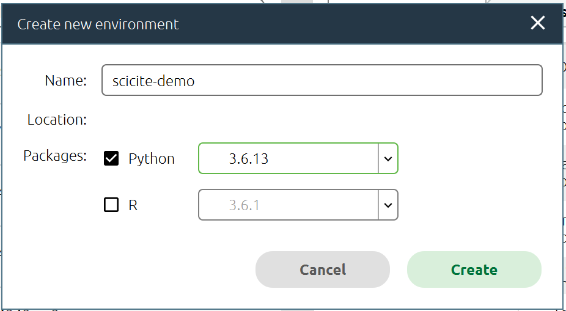
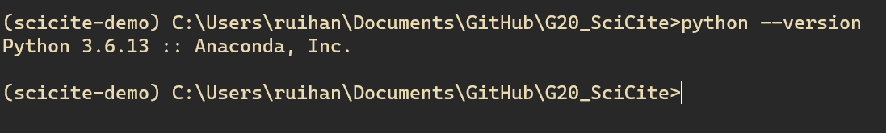
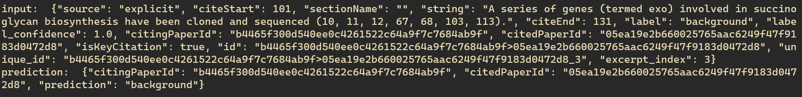
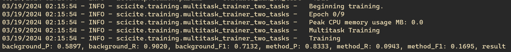

# <p align=center>`SciCite`</p> 

[](https://paperswithcode.com/sota/citation-intent-classification-acl-arc?p=structural-scaffolds-for-citation-intent) [](https://paperswithcode.com/sota/sentence-classification-acl-arc?p=structural-scaffolds-for-citation-intent) [](https://paperswithcode.com/sota/citation-intent-classification-scicite?p=structural-scaffolds-for-citation-intent)

This repository contains datasets and code for classifying citation intents in academic papers.  
For details on the model and data refer to our NAACL 2019 paper:
["Structural Scaffolds for Citation Intent Classification in Scientific Publications"](https://arxiv.org/pdf/1904.01608.pdf).

## Setup Tutorial

To use this library, you must use Python 3.6.X. Also ensure that you have pip installed, as we will be using pip to install our packages into the virtual environment.

Create a virtual environment, either with Anaconda or with pip, with Python 3.6.X. In this tutorial, I am using Python 3.6.13.



Activate the virtual environment, either with Anaconda navigator or with the command line.



Install `allennlp==0.8` into the virtual environment. It is important to use this version of AllenNLP, as the code in this repository is not compatible with the latest version of AllenNLP.

```bash
pip install allennlp==0.8 --default-timeout=100
```

`--default-timeout=100` is used to increase the timeout for downloading the pytorch module. The download may fail if the timeout is not increased.

Once completed, run:
```bash
pip install -r requirements.in -c constraints.txt
```

This will install all the required packages for the project.

Next, install the following important patches to fix stray errors:
```
pip install greenlet==0.4.16 overrides==3.1.0 jsonnetbin
```

Now, download the pretrained SciCite model from the following link:

[`SciCite`](https://s3-us-west-2.amazonaws.com/ai2-s2-research/scicite/models/scicite.tar.gz)

I named my `tar.gz` file `scicite-pretrained.tar.gz` and put it in under a folder called `scicite`. Please remember the path to this file.

For me, my path is:
```bash
C:\Users\ruihan\Downloads\scicite\scicite-pretrained.tar.gz
```

To begin training, download the 22.1MB scicite data file, extract it and rename the parent folder to `data`.

```
data
├── dev.jsonl
├── test.jsonl
|── train.jsonl
└── scaffolds
    ├── sections-scaffold-train.jsonl
    └── cite-worthiness-scaffold-train
```

Please also remember to path to the `data` folder. I put this folder in the same directory as the `scicite` folder.

So, my path is:
```bash
C:\Users\ruihan\Downloads\scicite\data
```

You can now run the allennlp prediction. The command is slightly different from Linux.

On Windows, the equivalent prediction command as below is:
```bash
python -m allennlp.run predict "PATH\TO\scicite-pretrained.tar.gz" "PATH\TO\data\train.jsonl" --predictor predictor_scicite --include-package scicite --overrides "{'model':{'data_format':''}}"
```

You can see the prediction results in the command line.



The sentence "A series of genes (termed exo) involved in succino glycan biosynthesis have been cloned and sequenced (10, 11, 12, 67, 68, 103, 113)." is classified as `background`.

From this, we can see that `allennlp.run predict` is the final command used to test the classifier model.

## Training

To customize and train our own model, perhaps with different feature sets or hyperparameters, the `train_local.py` script is used.

This **requires** a correct `json` config file to be set up, so we can use the example config file `scicite-experiment.json` in the `experiment_configs` folder.

However, it uses the `std.extVar`, which is a environment variable getter. This is not supported in Windows, so we need to replace the `std.extVar` with the actual number or string.

For example:
```json
  "random_seed": std.extVar("SEED"),
  "pytorch_seed": std.extVar("PYTORCH_SEED"),
  "numpy_seed": std.extVar("NUMPY_SEED"),
  "mixing_ratio": std.extVar("mixing_ratio"),
  "mixing_ratio2": std.extVar("mixing_ratio2"),
  "dataset_reader": {
    "type": "scicite_datasetreader",
    "use_sparse_lexicon_features": false,
    "multilabel": false,
    "with_elmo": std.extVar("elmo")
  },
```
becomes
```json
  "random_seed": 30,
  "pytorch_seed": 30,
  "numpy_seed": 30,
  "mixing_ratio": 0.5,
  "mixing_ratio2": 0.5,
  "dataset_reader": {
    "type": "scicite_datasetreader",
    "use_sparse_lexicon_features": false,
    "multilabel": false,
    "with_elmo": true
  },
```

Next, ensure your paths to your training data and scaffolds are set up correctly. They should point to your prior data folder that you downloaded and arranged.

```json
"train_data_path_aux": "PATH\\TO\\data\\scaffolds\\sections-scaffold-train.jsonl",
"train_data_path_aux2": "PATH\\TO\\data\\scaffolds\\cite-worthiness-scaffold-train.jsonl",
"train_data_path": "PATH\\TO\\data\\train.jsonl",
"validation_data_path": "PATH\\TO\\data\\dev.jsonl",
"test_data_path": "PATH\\TO\\data\\test.jsonl",
```

Finally, if you **do not have a GPU**, you must set the `cuda_device` to `-1` in the config file. Of course, if you do have a GPU, it would be preferable to use it.
```json
"trainer": {
  "num_epochs": 10,
  "grad_clipping": 5.0,
  "patience": 4,
  "validation_metric": "+average_F1",
  "cuda_device": -1,
  "optimizer": {
    "type": "adadelta",
    "rho": 0.95
  }
}
```

Finally, the command needs a folder to output the training logs and results into. Create a new folder in the root of the project called `serialization`.


Now, we can run the training command.

```bash
python scripts/train_local.py train_multitask_2 "PATH\TO\G20_SciCite\experiment_configs\scicite-experiment.json" -s "PATH\TO\G20_SciCite\serialization" --include-package scicite
```

This outputs the current F1 scores into the console and also outputs into the serialization folder.



If you stop the training halfway, you can actually recover the training from the last checkpoint by using the `--recover` flag.

```bash
python scripts/train_local.py train_multitask_2 "PATH\TO\G20_SciCite\experiment_configs\scicite-experiment.json" -s "PATH\TO\G20_SciCite\serialization" --include-package scicite --recover
```

However, if you want to train a new model, you must **empty the entire serialization folder** and start the training again.

---
## Data

We introduce `SciCite` a new large dataset of citation intents. Download from the following link:

[`scicite.tar.gz (22.1 MB)`](https://s3-us-west-2.amazonaws.com/ai2-s2-research/scicite/scicite.tar.gz)  


The data is in the Jsonlines format (each line is a json object).   
The main citation intent label for each Json object is spacified with the `label` key while the citation context is specified in with a `context` key.
Example entry:

```
{
 'string': 'In chacma baboons, male-infant relationships can be linked to both
    formation of friendships and paternity success [30,31].'
 'sectionName': 'Introduction',
 'label': 'background',
 'citingPaperId': '7a6b2d4b405439',
 'citedPaperId': '9d1abadc55b5e0',
 ...
 }
```

You may obtain the full information about the paper using the provided paper ids with the [Semantic Scholar API](https://api.semanticscholar.org/).

We also run experiments on a pre-existing dataset of citation intents in the computational linguistics domain (ACL-ARC) introduced by [Jurgens et al., (2018)](https://transacl.org/ojs/index.php/tacl/article/view/1266).
The preprocessed dataset is available at [`ACL-ARC data`](https://s3-us-west-2.amazonaws.com/ai2-s2-research/scicite/acl-arc.tar.gz).

## Setup

The project needs Python 3.6 and is based on the [AllenNLP](https://github.com/allenai/allennlp) library.

#### Setup an environment manually

Use pip to install dependencies in your desired python environment

`pip install -r requirements.in -c constraints.txt`


## Running a pre-trained model on your own data

Download one of the pre-trained models and run the following command:

```bash
allennlp predict [path-to-model.tar.gz] [path-to-data.jsonl] \
--predictor [predictor-type] \
--include-package scicite \
--overrides "{'model':{'data_format':''}}"
```

Where 
* `[path-to-data.jsonl]` contains the data in the same format as the training data.
* `[path-to-model.tar.gz]` is the path to the pretrained model
* `[predictor-type]` is one of `predictor_scicite` (for the SciCite dataset format) or `predictor_aclarc` (for the ACL-ARC dataset format).
* `--output-file [out-path.jsonl]` is an optional argument showing the path to the output. If you don't pass this, the output will be printed in the stdout.

If you are using your own data, you need to first convert your data to be according to the SciCite data format.

#### Pretrained models

We also release our pretrained models; download from the following path:

* __[`SciCite`](https://s3-us-west-2.amazonaws.com/ai2-s2-research/scicite/models/scicite.tar.gz)__
* __[`ACL-ARC`](https://s3-us-west-2.amazonaws.com/ai2-s2-research/scicite/models/aclarc.tar.gz)__

## Training your own models

First you need a `config` file for your training configuration.
Check the `experiment_configs/` directory for example configurations.
Important options (you can specify them with environment variables) are:

```
  "train_data_path":  # path to training data,
  "validation_data_path":  #path to development data,
  "test_data_path":  # path to test data,
  "train_data_path_aux": # path to the data for section title scaffold,
  "train_data_path_aux2": # path to the data for citation worthiness scaffold,
  "mixing_ratio": # parameter \lambda_2 in the paper (sensitivity of loss to the first scaffold)
  "mixing_ratio2": # parameter \lambda_3 in the paper (sensitivity of loss to the second scaffold)
``` 

After downloading the data, edit the configuration file with the correct paths.
You also need to pass in an environment variable specifying whether to use [ELMo](https://allennlp.org/elmo) contextualized embeddings.

`export elmo=true`

Note that with elmo training speed will be significantly slower.

After making sure you have the correct configuration file, start training the model.

```
python scripts/train_local.py train_multitask_2 [path-to-config-file.json] \
-s [path-to-serialization-dir/] 
--include-package scicite
```

Where the model output and logs will be stored in `[path-to-serialization-dir/]`

## Citing

If you found our dataset, or code useful, please cite [Structural Scaffolds for Citation Intent Classification in Scientific Publications](https://arxiv.org/pdf/1904.01608.pdf).

```
@InProceedings{Cohan2019Structural,
  author={Arman Cohan and Waleed Ammar and Madeleine Van Zuylen and Field Cady},
  title={Structural Scaffolds for Citation Intent Classification in Scientific Publications},
  booktitle="NAACL",
  year="2019"
}
```
